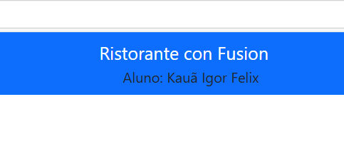

# Resumo da Aula

Na aula de hoje, aprendemos a instalar bibliotecas importantes, como React e Bootstrap, para criar nosso primeiro projeto React. Utilizamos os comandos recomendados com o `npm install` para instalar as dependências necessárias.

Além disso, exploramos o uso do **Reactstrap** para implementar componentes estilizados e praticamos a revisão de código HTML. Fizemos modificações para criar uma janela de navegação (Navbar), incluindo o nome do aluno como exemplo, configurando o arquivo `index.js` e outros componentes conforme solicitado na atividade.

### Etapas realizadas:
1. Instalamos as bibliotecas:
   - `reactstrap`
   - `bootstrap`
   - `react-popper` e `@popperjs/core`
2. Configuramos o arquivo `index.js` para importar o CSS do Bootstrap.
3. Criamos e modificamos o componente Navbar para exibir o nome do aluno.
4. Utilizamos o comando `commit` para subir as alterações ao GitHub, garantindo que nosso repositório fosse salvo online.

### Imagem do Navbar
Adicione aqui uma captura de tela do Navbar com seu nome personalizado:


```bash
    import { Navbar, NavbarBrand } from 'reactstrap';

      <Navbar dark color="primary">
      <div className="container">
      <NavbarBrand href="/">Ristorante Con Fusion</NavbarBrand>
      <div>Aluno: Fulano de Tal</div>
   </div>
 </Navbar>
```
**A primeira linha de codigo server para importar a bliblioteca do navbar e o navbarBrand para poder utilizar suas funcionalidades** 

**segunda linha  define a barra de navbar de cor preta  e a barra primaria do bootstrap** 

**terceira linha  define o nome como container e deixa ela centralizada  na barra de navegação** 

**quarta linha define o navbarBrand como o ristorante con funsion 
que feio que deixa ele como link direcionando para tela inicial meio que como um botão para voltar para a pagina inicial quando se click** 

**quinta linha eu defino o nome do aluno como foi pedido na questão 
ele exibe na tela o nome que foi digitado dentro do div e deixa ele centralizado na cor preta como foi definido no começo do codigo.**


# React component
Nossa aplicação precisa de um menu atraente! Aqui está como criamos um componente **Menu** dinâmico com React.

---
## Importações
Para começar, importamos três amigos importantes:

1. **React**: Para criar componentes e usar JSX.
2. **useState**: Para gerenciar dados dinâmicos.
3. **Media (reactstrap)**: Para layouts responsivos.

---

## Definição do Componente

Criamos uma função chamada **Menu**. Aqui, definimos dados e lógica para exibir pratos.

---

## Armazenamento dos Dados

Usamos **useState** para criar uma lista de pratos. Cada prato é um objeto com detalhes como nome, imagem e preço.

---

## Criação da Lista de Itens

Utilizamos o método **map** para transformar cada prato em um bloco visual. A imagem fica à esquerda, e o texto aparece à direita!

---

## Exibição na Tela

Organizamos os pratos em um contêiner principal usando **Bootstrap**. O **Media** garante um layout limpo e responsivo.

---

## Exportação do Componente

Finalmente, exportamos o **Menu** para ser usado em outras partes do projeto. para pode utilizar no github e atualizar nossos projetos.